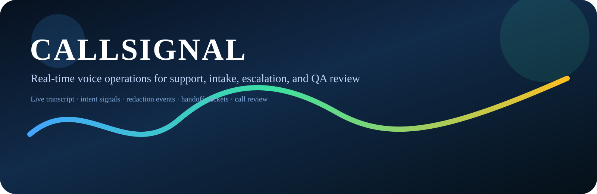

# CALLSIGNAL

CALLSIGNAL is a local-first voice operations platform for live support calls, structured intake, escalation routing, QA review, and audit-ready call history.

It is built around a simple premise: real voice operations are not a chatbot problem. They are a call-state problem, a transcript problem, a privacy problem, a handoff problem, and a review problem. CALLSIGNAL models those boundaries directly.



## Current Build Includes

- A deterministic voice session workspace with live transcript turns, call state changes, and event timelines.
- A supervisor board that summarizes total calls, active calls, escalations, intent mix, and QA trends from the seeded local database.
- A call review flow with transcript, signals, handoff packet, QA score, and export surfaces.
- An escalation queue that shows the supervisor-ready packet and resolution path.
- A privacy boundary that keeps raw values inside the backend and exposes only the safe transcript view to the UI.

## What Works Today

- Deterministic demo calls can be started from the Voice Workspace.
- Transcript frames stream into the UI as the scenario replays.
- Intent changes, redaction events, and extracted fields are tracked in the call log.
- Escalation rules produce a handoff packet when the call crosses the configured threshold.
- QA scoring is deterministic and visible in the workspace, QA center, and review views.
- Call history and supervisor views are populated from the seeded SQLite store.

## Planned Next

- Broaden the scenario library with a few more support-call shapes.
- Add more review filters and queue slices for larger call volumes.
- Tighten the visual system around the live call states and review states.
- Keep the local demo path stable and obvious before any public push.

## Why This Shape

The repository is organized around a voice session rather than a generic app shell. The backend is split into call sessions, transcript processing, conversation signals, privacy, handoff, quality review, and reporting because that is the actual lifecycle of a support call. The frontend is organized around the live call workspace, supervisor board, review screen, escalation queue, and QA center because those are the surfaces operators use.

## Demo Flow

1. Seed the local database with synthetic scenarios.
2. Start the API and the SvelteKit app.
3. Open the Voice Workspace.
4. Start a deterministic demo call.
5. Watch transcript frames, intent changes, redaction events, escalation signals, and QA updates stream into the UI.
6. Resolve, escalate, or end the call.
7. Open the Call Review and Supervisor Board for the resulting history.

The deterministic demo mode replays synthetic support calls from the scenario library instead of relying on external speech or model services.

## Call State Model

CALLSIGNAL treats each call as a stateful session. The implemented path includes connecting, active, handoff ready, and ended states, plus the events that move the session between them.

## Privacy Boundary

Raw values stay in the backend boundary. The UI receives the safe transcript projection, redaction events, and derived signals, but not the unredacted source data.

## Escalation and Handoff

When escalation rules trigger, the backend builds a handoff packet with the call summary, detected intent, extracted fields, escalation reason, queue recommendation, and redacted transcript excerpt.

## QA Scoring

The QA review path uses a deterministic rubric so the same call history produces the same score, missed items, and coaching notes.

## Visual Previews

The UI previews are based on implemented screens and are labeled as previews rather than screenshots.

- [Voice session architecture](diagrams/voice_session_map.svg)
- [Transcript signal lanes](diagrams/transcript_signal_lanes.svg)
- [Escalation and handoff flow](diagrams/escalation_handoff_flow.svg)
- [Redaction pipeline](diagrams/redaction_pipeline.svg)
- [QA review loop](diagrams/qa_review_loop.svg)
- [Voice Workspace preview](demo-kit/preview_assets/voice_workspace_preview.svg)
- [Supervisor Board preview](demo-kit/preview_assets/supervisor_board_preview.svg)
- [Call Review preview](demo-kit/preview_assets/call_review_preview.svg)
- [Escalation Queue preview](demo-kit/preview_assets/escalation_queue_preview.svg)

## Folder Structure Rationale

- `signal-server` holds the FastAPI backend, session engine, storage, and deterministic scenario playback.
- `call-room` holds the SvelteKit workspace, review screens, and live state stores.
- `scenario-lab` holds the call scripts, caller personas, and playback fixtures.
- `demo-kit` holds honest UI previews and demo runbooks.
- `diagrams` holds SVG architecture and flow diagrams that explain the build.
- `docs` holds product notes, local runbooks, API reference, and design decisions.

## Local Setup

```bash
cp .env.example .env
make bootstrap
make seed
make dev
```

The API listens on `http://127.0.0.1:8088` and the call room on `http://127.0.0.1:5173`.

## Commands

- `make bootstrap` installs Python and frontend dependencies.
- `make seed` loads synthetic demo scenarios and call history.
- `make demo-call` runs a deterministic scenario playback in the terminal.
- `make previews` generates the SVG preview assets from the live data model.
- `make test` runs backend tests, frontend type checks, and frontend tests.
- `make audit` checks for banned AI-trace wording and empty folders.

## API Surface

- `GET /healthz`
- `GET /config`
- `GET /calls`
- `POST /calls`
- `GET /calls/{call_id}`
- `POST /calls/{call_id}/start`
- `POST /calls/{call_id}/end`
- `POST /calls/{call_id}/resolve`
- `POST /calls/{call_id}/escalate`
- `POST /calls/{call_id}/handoff`
- `GET /calls/{call_id}/timeline`
- `GET /calls/{call_id}/transcript`
- `GET /calls/{call_id}/signals`
- `GET /calls/{call_id}/quality`
- `GET /calls/{call_id}/report`
- `POST /calls/{call_id}/report/export`
- `GET /queue/escalations`
- `GET /supervisor/summary`
- `GET /supervisor/intent-mix`
- `GET /supervisor/quality-trend`
- `GET /demo/scenarios`
- `WS /stream/calls/{call_id}`

## Verification

Run the following before publishing:

```bash
find . -type d -empty
bash tools/verify_no_ai_traces.sh
bash tools/check_empty_folders.sh
pytest signal-server/tests -q
npm --prefix call-room run check
npm --prefix call-room test
make seed
make demo-call
make test
```
